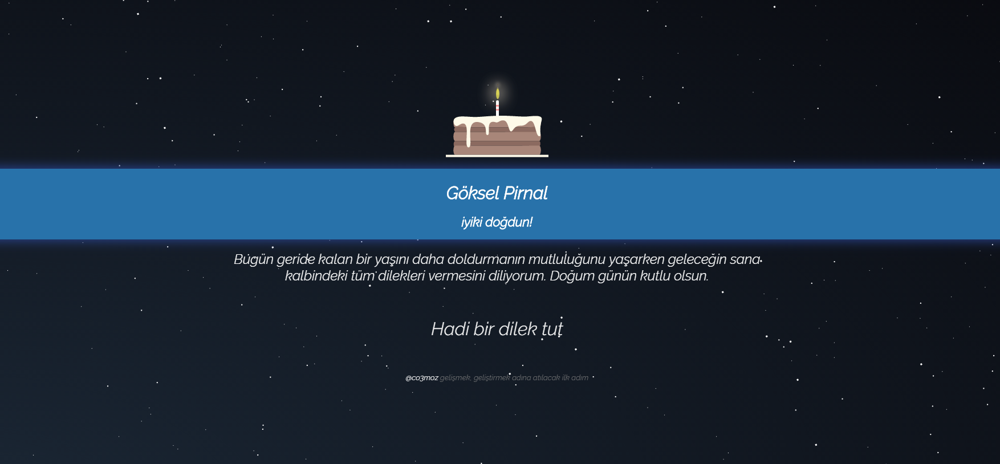

iyikidogdun.be
============

İyi ki doğdun be :)

Kullanım
----------------
`kisi_adi.iyikidogdun.be`

Türkçe isimleri tespit edip çeviri yapar. Örneğin, `goksel` -> `Göksel` haline gelir.

Örnekler:
* http://dogan.iyikidogdun.be
* http://goksel.iyikidogdun.be
* http://furkan.iyikidogdun.be
* http://burak.iyikidogdun.be

Eğer soyadı da eklenecekse nokta konularak bu işlem yapılabilir, soyadların çevrilmesi mümkün olmadığı için türkçe karakterler yazılmayabilir.

* http://goksel.pirnal.iyikidogdun.be



Benim adımı çevirmiyor
-----------------------
Adınızı ister pullrequest'le yada issue açarak bildirebilirsiniz. Bu sayede gerekli eksikliği tamamlamış oluruz

Nasıl ayağa kalkıyor bu meret
-------------------
Docker üzerinde nginx image kullanarak statik dosyaları serve ediyor. Docker üzerinde çalıştırmak için tek yapılması gereken

```js
docker run -d -p 80:80 co3moz/iyikidogdunbe
```

Kaynak
-----------
[Pasta](http://codepen.io/fixcl/pen/bsIhn)

Geliştirme
----------------

* Lütfen projeye sizde katkı yapın
* Pull requestlerinizi bekliyorum :)
