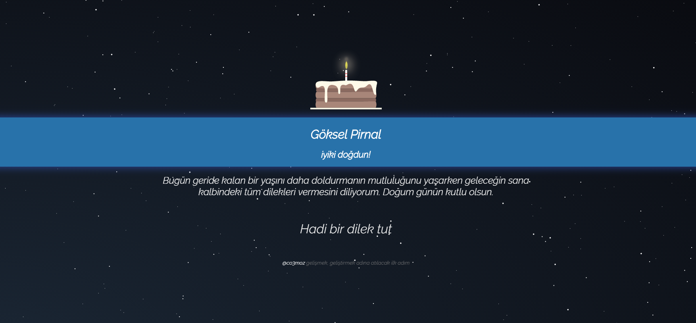

iyikidogdun.be
============

İyiki doğdun be :)

Kullanım
----------------
`kisi_adi.iyikidogdun.be`

Türkçe isimleri tespit edip çeviri yapar. Örneğin, `goksel` -> `Göksel` haline gelir.

Örnekler:
* http://dogan.iyikidogdun.be
* http://goksel.iyikidogdun.be
* http://furkan.iyikidogdun.be

Eğer soyadı da eklenecekse nokta konularak bu işlem yapılabilir, soyadların çevrilmesi mümkün olmadığı için türkçe karakterler yazılmayabilir.

* http://goksel.pirnal.iyikidogdun.be

Geliştirme
----------------

Lütfen geliştirmeye sizde katkı yapın. Pull requestlerinizi bekliyorum :)
